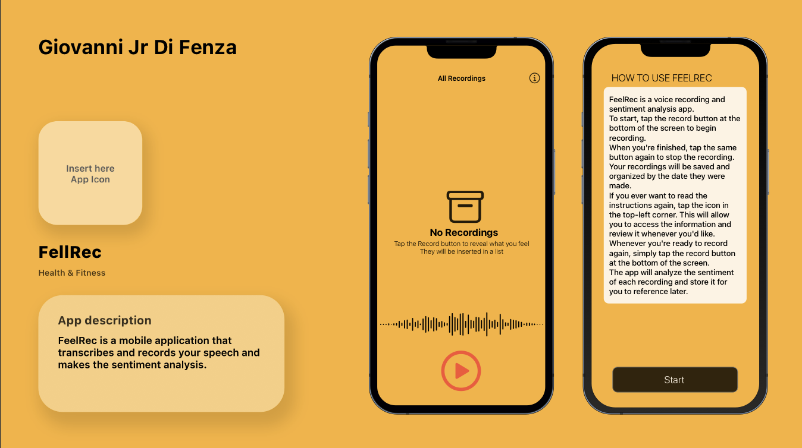

# FeelRecApp

FeelRec is an iOS app built with XCode that records and trascribes what the user says, to help people to keep track of your feelings and improving their emotional awareness, exploiting physiological parameters. 

## Key Features

- Transcribing speech to text
- Sentiment analysis by CoreML
- Adding data of your physiological parameters

## Installation

1. Clone this repository: `git clone <https://github.com/Orso-bit/FeelRecApp.git`>
2. Open the project in Xcode
3. Run the app on a simulator or connected device
