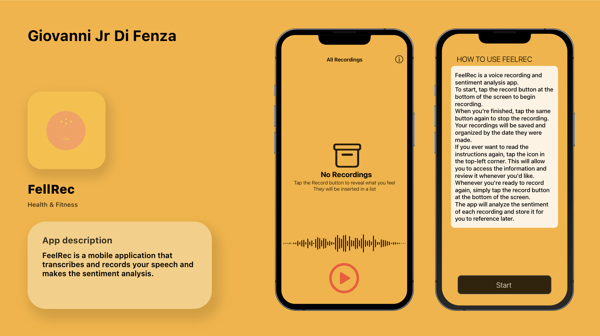

# FeelRecApp

FeelRec is an iOS app built with XCode that records and trascribes what the user says and makes the sentiment analysis to help people to keep track of their own feelings and improving their emotional awareness. FeelRec is inspired by **Voice Memos** and **Journal** iOS mobile applications.

## Key Features

- **Transcription** of speech to text
- **Recording** of speech
- **CoreML** for sentiment analysis

## Installation

1. Clone this repository: `git clone <https://github.com/Orso-bit/FeelRecApp.git`>
2. Open the project in Xcode
3. Run the app on a simulator or connected device
